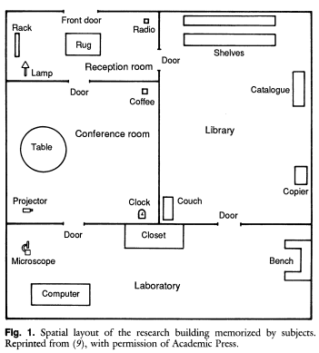
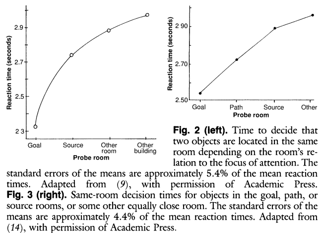

# Bower, G. H., & Morrow, D. G. (1990). Mental Models in Narrative Comprehension. Science, 247(4938), 44-48.

>  Readers of stories construct mental models of the situa- tion and characters described. They infer causal connec- tions relating characters' actions to their goals. They also focus attention on characters' movements, thereby acti- vatng nearby parts of the mental model. This activation is revealed in readers' faster answering of questions about such parts, with less facilitation the greater their distance from the focus. Recently visited as well as imagined locations are also activated for several seconds. These patterns of temporary activation facilitate comprehen- sion. 

Includes review of Trabasso's causal networking theory. 

> Trabasso and his associates (4) analyzed many simple narratives, asking whether each event (described in a story statement) was enabled or caused by earlier events, or enables  or causes later events. In a coherent story, the enabling events and causes form a web of connections among other events and condi- tions. A statement's number of connections determines how central- ly important readers consider it to be. This connectivity in turn determines the likelihood that a given statement (or event) will be recalled and included in subjects' brief summary of the story (4). Thus, causal connectivity provides a highly valid predictor of what readers will judge to be the gist of a narrative. 

Bower likes this because it provides a more concrete specification of story centrality. Also less circular than what i see in stuff like the Landscape model.

Section on "Goals and plans as causes". Cites a paper with Foss but I can't find it. Title isn't there, either? Big claim: "Readers take longer to understand an action in a story as the number of independent goals the actor has increase". Hope I can find the source someday, because I don't think the landscape model or CMR could account for that.

<!--TODO: find the paper matched with this claim.>

Then spatial situation models. Two more papers cited as distinguishing between major and minor characters and the focus on the former, but citations aren't clear enough to find papers. Maybe I hate this paper after all.

