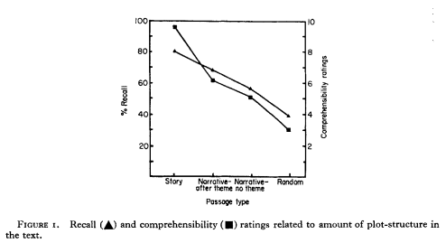
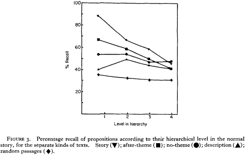
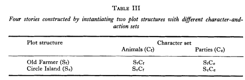
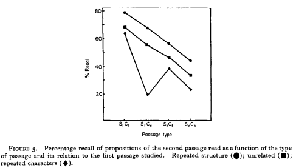
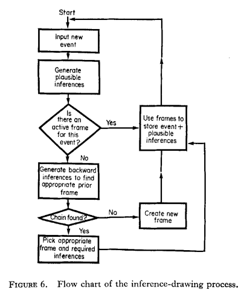
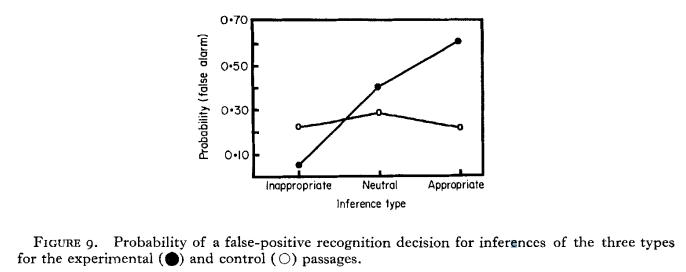

# Bower, G. H. (1976). Experiments on Story Understanding and Recall. The Quarterly Journal of Experimental Psychology, 28(4), 511-534.
@bower1976experiments
#review

## Sections

### Stories have a constituent structure

#[[Story Grammars]]
>  that is, they have a constant set of abstract constituents such as a setting, characters, a plot, episodes, a resolution, and so on, all of which are put together in a principled way so as to make a coherent whole.

> Indeed, for a class of what are called “problem-solving” folktales, there may even be a grammar describing the structure of well-formed stories (see Rumelhart, 1975). 

> The hypothesis would say further that texts that radically violate the rules of such a grammar would be incoherent or incomprehensible as stories. #Predictions

[[Rumelhart, D. E. (1975). Notes on a schema for stories. In Representation and understanding (pp. 211-236). Morgan Kaufmann.]]

### Experiments on violating goal-structure rules
> One of the first experiments that we planned and Thorndyke ran was to delete certain critical components of the goal-structure in the Farmer story. If we remove the over-riding goal and re-order the events so that the subject cannot detect the implicit goal hierarchy of the original story, we get the text entitled “narrative-no theme”.  #Stimuli

Recall (A) and comprehensibility (m) ratings negative related to amount of plot-structure in the text. #Effects #[[Goal-Based Organization]]

> Let us consider why a coherent story is remembered better than the narration of a series of unrelated events. Several factors probably contribute to the difference. 
> First, the coherent story is more easily comprehended during learning because it fits the story frame so well that the reader’s predictions about events are being consistently confirmed. That is, ease of understanding an event depends upon its predictability given the context. 
> Second, the abstract story framework provides a restrictive set of retrieval cues which the person can generate to prompt his recall of the several components and episodes. You can think of this advantage as much like that produced by providb ing a free-recall subject with the names of the categories represented on the word list he is recalling. Subjects who studied the unrelated episodes of the narrative tend to show all-or-none forgetting of entire episodes much like a free-recall subject may fail to retrieve a whole category of words from his study list. In contrast, the story-frame provides a set of cues that prevent this complete loss from occurring for subjects who read the coherent story. 
> A third factor promoting better recall of the coherent story is that the redundancy or interconnectedness of the text components is much greater for the coherent story than for the narration of unrelated events. A given episode in the goal hierarchy of the coherent story becomes connected in memory to the superordinate actions and goals which it enables and to the subordinate actions and outcomes upon which it depends. 

Recall rate is a phenomenon that CMR provides poor accounts for in general. #[[Modeling Issues]]

### Hierarchical ordering of propositions within a story 

> Percentage recall of propositions according to their hierarchical level in the normal story, for the separate kinds of texts. Story (v); after-theme (R); no-theme (e); description (A); random passages (+). 
#Stimuli

> The text propositions occur in this story at four different levels. So the centrality hypothesis predicts that a proposition like no. 34 (“Civil War appeared”), which is high in the hierarchy, will be much more salient and much better recalled than a proposition like no. 21 (“All the islanders voted on the construction issue”), which is at a lower level. 

We suppose that the higher up in the hierarchy a given proposition is, the more saIient it is, the easier it is to identify, the more central or important it is to the story, the more attention the person will pay to it and the more likely it is to be remembered. #Effects #[[Centrality Effects]]

### The Content vs the plot structure of a story
> One of the experiments Thorndyke and I planned demonstrated that recall of a text with a given goal structure was better the greater was the concreteness or imagery value of the characters and the more predictable were the actions the characters perform #Effects #[[Concreteness Effects]]

>  A subject would study one of these stories as his first story, and then study a different one for his second story. The second story could have the characters repeated in a new plot (for instance, SiCr followed by S&), or the plot structure repeated with new characters and actions (StCt followed by SfCC), or neither plot nor characters repeated (S&f followed by the unrelated ScC, story). All twelve possible ordered pairs of stories were used with four subjects reading each pair. 

> The most interesting effects concerned the proactive influence of the first story upon recall of the second. 

> The transfer effects between the two texts are obvious from the top and bottom lines in Figure 5. Recall of the second story is facilitated when it contains a repetition of the same general plot structure though with different characters. But recall is poorer when the second story uses the same characters in a different plot performing quite different actions-for example, the farm animals are voting to decide whether to spend money to build themselves a new barn. The results are remarkably orderly. #[[Transfer Effects]] #Effects

### Inference

 #[[Bridging Inference]]

> From this outline, the design of the experiment should be reasonably obvious. Subjects studied four different passages of 20 sentences. Each passage contained two such critical “event A” sentences. Different subjects read stories that were identical except for the loaded B statement or the neutral C statement. Two different groups were tested; one rated the plausibility of various inferences whereas the other performed a recognition memory test. 

> The results are shown in Figure 9, revealing that for the experimental passages the likelihood of identifying an inference as having been in the text increased directly with its plausibility. #Effects Appropriate inferences drew 58% false alarms, whereas inappropriate inferences drew 6% false alarms. The control subjects who read the neutral later sentence (event C) treat all the inferences more or less alike, as deserving of about 25% false alarms. 

> This account supposes the effect of the loaded-event story is to increase the activation or strength of a bridging inference in memory at the time the text is read. An alternative and equally plausible account currently being tested is that the effect is not due to strength in memory of the bridging inference but rather is due to a subject’s willingness (“response bias”) during testing to accept any statement that he does not remember but which has high plausibility based on the propositions (like A and B) that he can remember.

### Conclusions
- Simple stories have a definite abstract structure.
- People acquire this abstract framework and leverage this background knowledge to sort out and understand new stories. If a text violates some structural patterns, texts seem less coherent, are harder to learn, and are forgotten more readily.
- A hierarchical structure emerges from these patterns. Elements at higher levels are found more important and are more likely to be remembered and included in summaries. The recall of a story increasingly looks like a summary of it.
- Plot structure is dissociable from its content in memory. "Recall varies according to the concreteness of the characters and their actions and also according to the coherence or “goodness” of the plot structure. 
- Transfer effects: across three similar biographies, selective facilitation or interference of specific facts depending on whether they were repeated or changed.
- Bridging inference:  understanding some sentences in a story requires the listener to build a backwards bridge of inferences to information provided by an earlier statement in the text, affecting their memory representation. This account of how inferences are activated and lodged in memory was supported by high false alarm rates to such bridging inferences.  