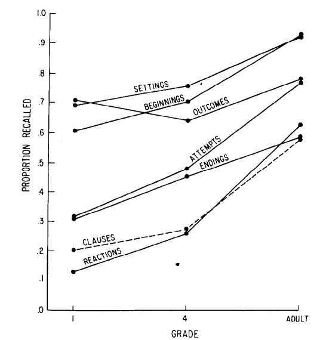

# Mandler, J. M., & Johnson, N. S. (1977). Remembrance of Things Parsed: Story Structure and Recall. Cognitive Psychology, 9(1), 111-151.
@mandler1977remembrance

> An analysis of the underlying structure of simple stories is presented. It is claimed that this type of representation of stories is used to form schemata which guide encoding and retrieval. A type of tree structure containing basic units and their connections was found to be adequate to describe the structure of both single and multi-episode stories. The representation is outlined in the form of a grammar, consisting of rewrite rules defining the units and their relationships. Some transformational rules mapping underlying and surface structures are discussed. The adequacy of the analysis is first tested against Bartlett's protocols of “The War of the Ghosts.” Then a developmental study of recall is presented. It is concluded that both children and adults are sensitive to the structure of stories, although some differences were found. Finally, it is suggested that the schemata used to guide encoding and recall are related but not identical and that retrieval is dependent on the schemata operative at the time of recall.

Presents a theory; most evidence reported in other studies. 

#Stimuli segments the War of the Ghosts into propositions for us! This and a few other studies are organized into story grammars.

Story grammars are used to interpret patterns in recall data from prior experiments.

Reports a study on children focusing on recall rates as function of story grammar component (e.g. settings, beginnings, outcomes, attempts, endings, etc) as well as of age.

Stories are provided and "mapped" in full to story grammars. Also segmented into propositions for us!

Only summary statistics reported, but that's normal. Lots of discussion of recall order though. Eg:

> More sequence inversions occurred between propositions within basic nodes (6.3%) and between phrases within propositions (14.7%) than between basic nodes. There were fewer sequence inversions within basic nodes than had been expected, in part because typically only one proposition from a node was recalled. Of the inversions that did occur, 88% were between AND and THEN connected propositions.  

Also a discussion of additions of new material:
> Additions or importations of new material during recall were classified into three types. The first class consisted of emphatic additions (e.g., “ferocious” dragon) or of repetition of a proposition expressed in a slightly different way. The latter frequently appeared to be an attempt on the part of the subject to ensure that the experimenter knew what character or action was being referred to. The second class consisted of a reasonable elaboration of a proposition, such as adding a presupposition, or explaining in more detail how or why something happened in the story. T

Suggests that coding free recall data will remain a pretty difficult task even if we're given propositions of the source material for free.

That last sentence is really interesting: " Finally, it is suggested that the schemata used to guide encoding and recall are related but not identical and that retrieval is dependent on the schemata operative at the time of recall.":

> One of the reasons for resting the grammar on this base is that many effects of the schemata we are seeking to characterize can more readily be seen in the operation of memory processes. For example, some of the transformations we have discussed do not appear to affect comprehension as much as recall. There are more options during encoding; people can follow and make sense of many kinds of twists and turns in incoming material. Even highly irregular sequences which do not match any familiar schema can be temporarily maintained. Memory is less rich and flexible. Not only does memory simplify, but material presented in an unusual sequence will gradually conform to a more logical structure than the one constructed during input. If the structure imposed at input was a new one, it is apt to be unstable, and if the material can be retrieved at a later time, more familiar schemata will be used. An example of an unstable organization being replaced by a more familiar schema has been shown by Mandler and Parker (1976) for pictures of complex scenes. Some of the most dramatic examples of a change in schema from encoding to retrieval are those of Piaget and Inhelder (1973). A child encoding a row of seriated sticks does so on the basis of his or her current concept of seriation and makes a reconstruction appropriate to the level of comprehension operative at the time of input. When asked to reproduce the sticks some months later, the child uses the concept of seriation as a retrieval cue, but the concept has changed. Thus, what is reproduced the second time may bear little resemblance to the original reconstruction. These considerations indicate that memory is less strictly determined by processes occurring at the time of encoding than is suggested by some current conceptions of memory (e.g., Craik & Tulving, 1975).

Not too threatening. 

I don't think this paper is central enough to deserve emphasis in the review, but it's got good stuff.