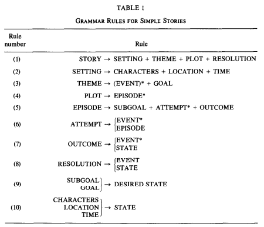

# Thorndyke, P. W. (1977). Cognitive Structures in Comprehension and Memory of Narrative Discourse. Cognitive Psychology, 9(1), 77-110.

#[[Story Grammars]] #[[Centrality Effects]]

> The effects of structure and content variables on memory and comprehension of prose passages were studied in two experiments. The experimental passages exemplify a class of simple narrative stories that is described by a generative grammar of plot structures. A comprehension model is proposed that assumes a hierarchical organizational framework of stories in memory, determined by the grammar, representing the abstract structural components of the plot. The quality and characteristics of subjects' memory for stories were tested on a variety of experimental tasks in which story organization was manipulated. Comprehensibility and recall were found to be a function of the amount of inherent plot structure in the story, independent of passage content. Recall probability of individual facts from passages depended on the structural centrality of the facts: Subjects tended to recall facts corresponding to high-level organizational story elements rather than lower-level details. In addition, story summarizations from memory tended to emphasize general structural characteristics rather than specific content. For successively presented stories, both structure and content manipulations influenced recall. Furthermore, repeating story structure across two passages produced facilitation in recall of the second passage, while repeating story content produced proactive interference. The implications for a model of memory for narrative discourse are discussed.

The model of comprehension here is this story grammar. Stories can be analyzed in terms of this grammar. Elements near the top of the resulting hierarchy are predicted to be more salient, receiving more attention and being better remembered.

Details already high-level reviewed in [[Bower, G. H. (1976). Experiments on Story Understanding and Recall. The Quarterly Journal of Experimental Psychology, 28(4), 511-534.]]. 

It might be cool to reproduce this study and subject it to organizational analysis. To relate to current theory, we can think of these as studies on the importance of narrative coherence.

Paper's appendix has all stimulus materials (7 different stories). We can use these really promptly.