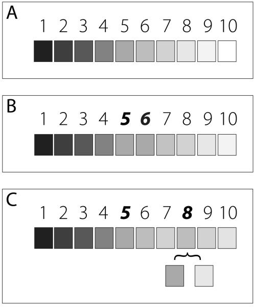

# Do Dynamic Semantic Connections Mediate Semantic Organization in Free Recall? A Proposal
I have been repeating for around a year now that the gap in CMR as an account of semantic organization in memory search is dynamic semantic connections. But what do I mean by that? Why do I feel that way? And how would one prove as much? Here I try to clear up all these questions—at least a little.

Retrieved-context theory (RCT) accounts for free recall of item lists by asserting that
1. studied items are associated with a gradually changing, recency-weighted representation of temporal context,
2. the contexts retrieved from studying (or recalling) items update the current state of context, and
3. the current state of context is the proximate cue for each item recall.

The context-maintenance and retrieval model [CMR; @polyn2009context] provides a computational specification of this theory, but its most common implementation treats items' feature representations as orthogonal to one another. Items are associated with one another in memory-based entirely on their position in the list. 

Morton & Polyn (2016) evaluate different accounts of how semantic knowledge might independently influence memory search within the framework of RCT and CMR. Their analyses focus on the retrieval processes, using vector space models of semantic similarity such as GloVe as their model of semantic association in memory. In one variant of CMR, the context representation mediates retrieval of both temporal and semantic associations: the model retrieves items' semantic associations in proportion to their maintenance in context. The model retrieves only the last recalled item's semantic associations in another variant. In both variants, semantic connections help explain performance on the free recall task. Still, these semantic connections are not dynamic; they are static throughout the encoding and retrieval process.

I think models like GloVe may provide a good account of word lists' pre-experimental semantic associations relevant for recall. However, these semantic associations may mediate and evolve throughout the encoding process, similarly to how temporal associations do. When a participant reads a word during the study phase of a free recall task, contextual reinstatement may depend on pre-existing semantic as well as temporal associations. Participants may then associate the item with this updated contextual state in memory. Moreover, since context is a slowly drifting representation, these dynamics can influence successive study events. These are dynamic semantic connections, but maybe a more specific term for what I am concerned with is a mechanism comprehension theorists call "coherence-based retrieval."

## Evidence In the Comprehension Literature
Coherence-based retrieval is central to many accounts of how readers comprehend coherent narratives. In studies on reading comprehension, the primary phenomenon that organizes theory competition is online inference. To integrate the current sentence into a representation of the overall narrative (e.g., understanding the second sentence in "Mary poured the water on the bonfire. The fire went out."), readers often have to perform backward inferences, a retrieval process. Readers take more time to process a sentence when information necessary to achieve coherence is less accessible in memory. Information accessibility during reading can be similarly probed by measuring the time it takes to verify sentences, answer questions, name semantically ambiguous words, and even eye-tracking and neural measures. These inform accounts of how narrative representations are structured and accessed, much like transitions in free recall data inform generic models of memory search. 

The most current debate in the comprehension literature concerns how and when readers perform inference while processing discourse representations like narratives (McNamara & Magliano, 2009). Coreference or anaphora resolution directly prompts many of these inferences. However, a massive body of evidence suggests that inferences are more commonplace than even that. Inference is highly sensitive to the semantic content in a story. Situational dimensions like space, time, causation, and even goal- or character-relevance can shape which information is most accessible (Zwaan & Radvansky, 1998). To account for these patterns, theories like the Resonance model of comprehension (Myers & O'Brien, 1998) propose that concepts and propositions in the discourse representation resonate in response to related elements in the current sentence. This mechanism retrieves even distant associations via a memory-based process. The Landscape model (van den Broek, Risden, Fletcher & Thurlow, 1996) integrates this coherence-based retrieval mechanism into a simple connectionist model and bears striking similarities to CMR. I have alluded that these mechanisms are not without controversy in the comprehension literature. However, they help account for memory effects across a surprising variety of methodological paradigms. 

## Connecting to the List Memory Literature
Based on this and other evidence, I strongly suspect a variant of CMR with a coherence-based contextual reinstatement mechanism could successfully bridge both narrative and memory research domains. However, whether this mechanism is relevant in the classic free recall task paradigm remains unclear. More generally, we have yet to specify the predictions provided by coherence-based contextual reinstatement about the free recall task. At the moment, I favor tackling these ambiguities with more basic list memory research before then relating our findings to narrative comprehension and memory.

Among other things, Morton & Polyn (2016) concluded that an item-based cue rather than a context-based cue drives the semantic organization of free recall. However, if one takes the view that semantic connections between items evolve through coherence-based contextual reinstatement, their evidence for this view might not be convincing. The reason is that the semantic connectivity matrices used to compare the item- and context-based cueing hypothesis may not accurately reflect acquired semantic associations. Previously unassociated words may become semantically associated and vice versa, altering distances between items.

How do we evaluate the two cueing hypotheses in light of this issue? One approach might be to use a connectivity matrix that reflects evolved semantic connections. The landscape model of reading comprehension, for example, can simulate a candidate matrix. However, since we do not know whether the landscape model is a good account of how semantic connections evolve throughout sequence processing, this potentially puts the cart before the horse and makes results difficult to interpret.

Another possible approach might be to select stimulus sequences where the effects of hypothetical coherence-based contextual reinstatement mechanisms are easier to understand. I think we can take a page from studies on repetition effects in free recall to generate such sequences. In the fourth condition of Lohnas & Kahana's (2014) experiment on repetition effects, study lists contained mostly singly presented list items with some repeatedly-presented items interspersed among them. This design enabled researchers to specify and test novel theoretically constraining hypotheses about how item repetitions are processed in memory. I think a similar design could improve our ability to cleanly make and test predictions about the role of semantic similarity in memory search. We can use lists of mostly semantically unrelated words interspersed with spaced-out pairs of semantically related words.

From there, we can test for effects of similarity-based contextual reinstatement and cueing similarly to how we might measure repetition effects in free recall. Lohnas & Kahana (2014) present evidence for the hypothesis that re-studying an item reinstates the temporal contextual state associated with its initial presentation. They found that neighbors of repeated items (i.e., items at positions i+1, i+2 and positions j+1, j+2 where i and j are the two presentation positions of a single item) were more likely than chance to transition between one another during free recall. This result implied that the contextual state from the item's first presentation had upon the second presentation been reinstated and then encoded in successively-presented items' temporal contextual associations. We can measure whether semantic similarity drives contextual reinstatement during encoding using the same analysis. We would only treat semantically similar items like Lohnas & Kahana (2014) treated item repetitions. Since the analysis is of transitions between semantically dissimilar items (which neighbored similar items), it sidesteps the question of item- or context-based semantic cueing emphasized by Morton & Polyn (2016). Instead, the analysis measures whether pre-experimental semantic associations shape the encoding process! 

I cannot imagine that either CMR or the variants explored in Morton & Polyn (2016) could account for positive detection of such an effect. And honestly, I'm unsure what a CMR variant that does account for the effect would look like. But the point is that we'd then have an objective function to guide us toward just that, and potentially a model of more diverse stimulus sequences.

if we observe it as I predict. If we do not observe an effect, we would still rule out a whole class of potential models of semantic organization's role in memory search. At the same time, we would gain a scaffold to distinguish between memory for semantically-related words and coherent narratives.

